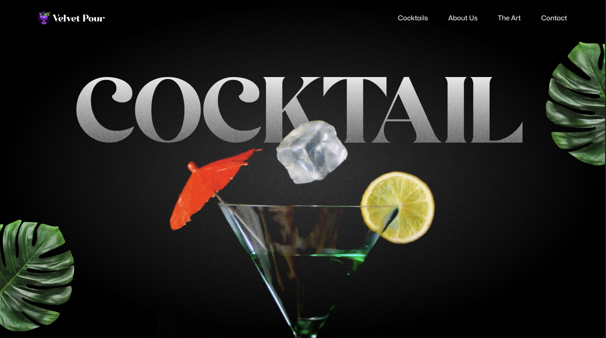

<div align="center">
  <br />
  <a href="https://velvet-pour-cocktail.vercel.app/" target="_blank">
    
  </a>
  
  <div>
    
    
    
  </div>

  <div align="center">
     <h3>🍹 Velvet Pour: Stunning GSAP Cocktail Website</h3>
    A scroll-driven, animated cocktail website featuring <b>SplitText reveals, ScrollTrigger timelines, pinned sections, parallax scrolling, scroll-synced videos, image masking, and custom carousels</b>.<br/>
    <i>Fully responsive and perfect for exploring advanced GSAP animations in React.</i>
  </div>

  <br />

  <a href="https://velvet-pour-cocktail.vercel.app/" target="_blank">
    
  </a>
  <br />
</div>


---

## 📋 <a name="table">Table of Contents</a>

1. 🤖 [Introduction](#introduction)
2. ⚙️ [Tech Stack](#tech-stack)
3. 🔋 [Features](#features)
4. 🤸 [Quick Start](#quick-start)

---

### <a name="introduction">🤖 Introduction</a>

Build and deploy a stunning GSAP-powered cocktail website using **React** and **Tailwind CSS**—a modern, scroll-driven
experience packed with advanced animations. Bring your design to life with:

- **Dynamic SplitText reveals** for bold section intros
- **Smooth parallax scrolling** and scroll-triggered effects
- **Pinned sections** for immersive storytelling
- **Scroll-synced video playback** for cinematic impact
- **Scroll-based image masking** for visually striking transitions
- **Custom animated carousel** for showcasing content
- **Seamless multi-section timelines** for smooth flow
- Fully **responsive UI** across all devices

This project combines creative motion design with interactive components to deliver a polished, modern web experience.

---

### <a name="tech-stack">⚙️ Tech Stack</a>

- **[GSAP](https://gsap.com/)** is a powerful JavaScript animation library used in this project to create dynamic,
  scroll-driven visuals. Features include SplitText animations for bold text reveals, ScrollTrigger for timeline
  control, parallax scrolling, pinned sections, scroll-synced video playback, seamless multi-section timelines, image
  masking effects, and a fully custom animated carousel.

- **[React](https://react.dev/)** is a declarative JavaScript library for building interactive UIs. It provides the
  component structure for modular development, allowing smooth integration of GSAP animations, reusable logic for scroll
  behavior, and support for responsive layout and state-driven UI features like carousels and video sections.

- **[Tailwind CSS](https://tailwindcss.com/)** is a utility-first CSS framework that allows developers to design custom
  user interfaces by applying low-level utility classes directly in HTML, streamlining the design process.

- **[Vite](https://vitejs.dev/)** is a lightning-fast build tool and development server that powers this project’s
  workflow. It enables instant hot module replacement, fast startup, and optimized production builds—ideal for an
  animation-heavy React site with smooth, real-time development feedback and minimal config.

---

### 🎨 UI/UX Design

The entire interface of **Velvet Pour – GSAP Cocktail Website** is crafted to deliver a smooth, immersive, and visually
stunning experience. From scroll-triggered sections to animated carousels and video-synced storytelling, every element
follows a **modern, elegant, and responsive design system** that enhances both interactivity and aesthetics.

<p align="center">
  <a href="https://www.figma.com/design/LVdc2zP8j8ZEd4agVV0JVJ/Cocktail-GSAP-Website?node-id=2-2&t=ZuHsjCp9sK5MfcW7-1" target="_blank">
    
  </a>
</p>

---

### <a name="features">🔋 Features</a>

- **SplitText Animations**: Create impactful text reveals using GSAP’s SplitText for dynamic intros and section
  highlights.

- **ScrollTrigger Effects**: Power scroll-based animations and timeline control with GSAP’s ScrollTrigger.

- **Parallax Scrolling**: Add immersive depth with smooth parallax effects that respond to user scroll.

- **Pinned Sections**: Lock sections in view while animating content for engaging scroll experiences.

- **Scroll-Synced Video Playback**: Sync video progress with scroll position for cinematic storytelling.

- **Image Masking Effects**: Use scroll-triggered pins and masks for visually striking image transitions.

- **Custom Carousel**: Build a fully customized carousel with multiple navigation options and animated slides.

- **Seamless Timeline Animations**: Craft smooth animation timelines that span across multiple sections.

- **Responsive Design**: Ensure fluid UI and adaptive GSAP animations across all screen sizes.

And many more, including enhanced security and optimized video performance!

---

### <a name="quick-start">🤸 Quick Start</a>

Follow these steps to set up the project locally on your machine.

**Prerequisites**

Make sure you have the following installed on your machine:

- [Git](https://git-scm.com/)
- [Node.js](https://nodejs.org/en)
- [npm](https://www.npmjs.com/) (Node Package Manager)

**Cloning the Repository**

```bash
git clone https://github.com/Itssanthoshhere/Velvet-Pour.git
cd Velvet-Pour
```

**Installation**

Install the project dependencies using npm:

```bash
npm install
```

**Running the Project**

```bash
npm run dev
```

Open [http://localhost:5173](http://localhost:5173) in your browser to view the project.

---

### <a name="#special-thanks"> 🙌 Special Thanks</a>

This app was originally inspired by JavaScript Mastery's, but built and customized independently with additional
improvements, UI changes, and debugging**.

---

### <a name="contacts">🔗 Contacts</a>

Feel free to connect with me:

* GitHub: [Itssanthoshhere](https://github.com/Itssanthoshhere)
* LinkedIn: [Santhosh VS](https://www.linkedin.com/in/thesanthoshvs/)

---

#### ⭐️ Show Your Support

If you liked this project, **give it a ⭐** and share it with others!

---